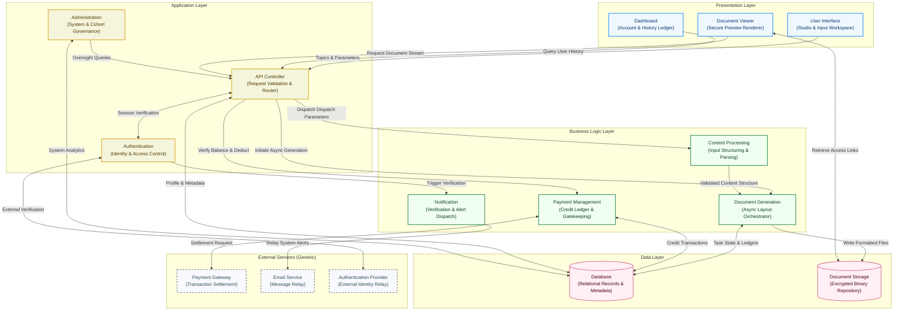
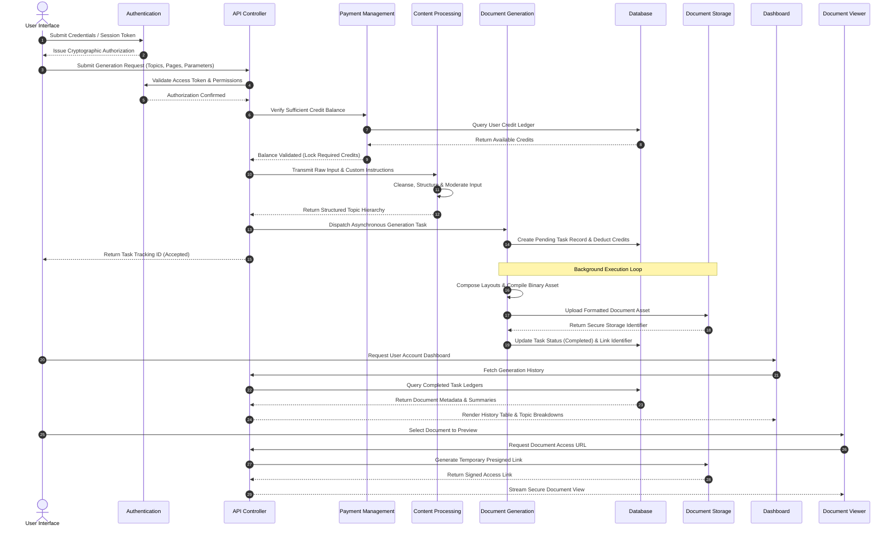

# SCRIB — SOFTWARE DESIGN DOCUMENTATION (SDD)
## High-Level System Architecture & Technical Specifications
**Document Classification:** Legal & Technical Documentation for Software Copyright Registration  
**System Name:** Scrib  
**Document Version:** 1.0  
**Date:** July 2026  

---

## TABLE OF CONTENTS
1. [Title Page & System Overview](#1-title-page--system-overview)
2. [High-Level Architecture Diagram](#2-high-level-architecture-diagram)
3. [Internal Module Architecture Diagram](#3-internal-module-architecture-diagram)
4. [Module Descriptions](#4-module-descriptions)
5. [Architecture Principles](#5-architecture-principles)
6. [Data Flow Summary](#6-data-flow-summary)

---

## 1. TITLE PAGE & SYSTEM OVERVIEW

### 1.1 Document Identification
* **Software Title:** Scrib
* **Nature of Work:** Original Software System (Client-Server Web Application & Processing Engine)
* **Scope:** Software Architecture, Logical Module Composition, and End-to-End Data Workflows
* **Purpose:** Formal documentation illustrating the logical design, internal structural hierarchy, and functional module integration of the Scrib software system for copyright registration.

### 1.2 System Purpose & Executive Summary
Scrib is a comprehensive, layered software platform designed to ingest user-specified curriculum topics and structural parameters, moderate and process text inputs, and asynchronously orchestrate the creation of custom study materials and formatted digital documents. The system integrates secure identity verification, transactional credit management, background task queues, and persistent object storage to deliver a resilient, scalable web application.

To comply with intellectual property protection standards, this specification details the architectural topology, logical boundaries, and inter-module communication protocols without disclosing proprietary algorithmic weights, internal moderation heuristics, vendor-specific model identifiers, or confidential cryptographic credentials.

---

## 2. HIGH-LEVEL ARCHITECTURE DIAGRAM

The architecture is structured into five distinct logical tiers: **Presentation Layer**, **Application Layer**, **Business Logic Layer**, **Data Layer**, and **External Services**. This separation ensures strict isolation between client interfaces, access control enforcement, core processing workflows, and data persistence.

---

## 3. INTERNAL MODULE ARCHITECTURE DIAGRAM

This diagram illustrates the internal execution sequence and data exchange across active system modules during a typical document creation and delivery cycle.

---

## 4. MODULE DESCRIPTIONS

### 4.1 User Interface Module
* **Purpose:** Serves as the interactive web workspace where end users formulate document specifications, customize structural layout parameters, and monitor active processing tasks.
* **Responsibilities:** Captures syllabus topics, enforces client-side schema validation, manages multi-page configuration forms, and renders real-time visual progress indicators during background processing.
* **Inputs:** User-keyed topic strings, page-count selections, structural instructions, and user profile updates.
* **Outputs:** Structured JSON request payloads dispatched to the API Controller, and rendered client-side view states.
* **Interactions with other modules:** Transmits authenticated payloads to the **API Controller**, receives session credentials from the **Authentication Module**, and coordinates with the **Dashboard** and **Document Viewer** modules for result presentation.

### 4.2 Dashboard Module
* **Purpose:** Provides a centralized account management interface for tracking historical document generations, credit consumption ledgers, and saved study materials.
* **Responsibilities:** Displays comprehensive tables of past generation tasks, exposes detailed page-by-page topic breakdowns, tracks available credit quotas, and handles promotional coupon redemption workflows.
* **Inputs:** User navigation events, filter requests, and coupon code entries.
* **Outputs:** Organized historical records, status badges, credit ledger summaries, and drill-down inspection panels.
* **Interactions with other modules:** Queries the **Database Module** (via the **API Controller**) to retrieve task logs, triggers verification requests to the **Payment Management Module**, and navigates users to the **Document Viewer Module**.

### 4.3 Document Viewer Module
* **Purpose:** Enables high-fidelity digital preview and secure consumption of generated documents directly within the client browser across desktop and mobile devices.
* **Responsibilities:** Renders binary document streams, supports pagination and zoom controls, displays side-by-side annotations of user-specified topics, and manages secure document downloads.
* **Inputs:** Document selection identifiers and temporary access tokens.
* **Outputs:** Visual document rendering frames and structured metadata banners.
* **Interactions with other modules:** Communicates with the **API Controller** to authorize document requests, retrieves encrypted binary streams from the **Document Storage Module** via signed access links, and synchronizes state with the **Dashboard Module**.

### 4.4 Authentication Module
* **Purpose:** Governs identity verification, session lifecycle security, and role-based access control across all client and administrative entry points.
* **Responsibilities:** Processes registration and login credentials, verifies one-time passwords (OTPs), issues and validates cryptographic web tokens, and restricts protected resources based on user permissions.
* **Inputs:** Registration details, login credentials, authentication tokens, and verification codes.
* **Outputs:** Signed session tokens, access control determinations, and security error codes.
* **Interactions with other modules:** Intercepts and validates requests flowing through the **API Controller**, coordinates with the **Notification Module** for verification dispatch, and interfaces with **External Authentication Providers**.

### 4.5 API Controller Module
* **Purpose:** Acts as the central application gateway and request orchestrator, directing incoming client traffic to appropriate backend processing modules.
* **Responsibilities:** Validates request payload schemas, enforces rate-limiting rules, coordinates multi-module transaction workflows, and formats standardized HTTP responses.
* **Inputs:** HTTP/HTTPS requests from client-side presentation modules and administrative tools.
* **Outputs:** Standardized JSON responses, task dispatch acknowledgments, and routed internal procedure calls.
* **Interactions with other modules:** Verifies authorization via the **Authentication Module**, checks balances via the **Payment Management Module**, delegates parsing to the **Content Processing Module**, and dispatches jobs to the **Document Generation Module**.

### 4.6 Content Processing Module
* **Purpose:** Cleanses, structures, and moderates raw user text inputs before they are submitted to the asynchronous document compilation engine.
* **Responsibilities:** Applies parsing heuristics to deduplicate and group raw topics, maps instructions to specific document pages, and validates input content against policy boundaries.
* **Inputs:** Raw syllabus strings, optional user instructions, and target page allocations.
* **Outputs:** Cleaned, structured topic hierarchies and moderation clearance confirmations.
* **Interactions with other modules:** Receives input specifications from the **API Controller**, executes internal validation algorithms, and delivers structured data payloads to the **Document Generation Module**.

### 4.7 Document Generation Module
* **Purpose:** Orchestrates the asynchronous, CPU-intensive compilation and formatting of structured inputs into polished digital document files.
* **Responsibilities:** Manages background task queues, applies typography and layout templates, calculates precise page allocations, compiles final binary files, and updates real-time task states.
* **Inputs:** Structured topic hierarchies, formatting templates, and unique generation tracking IDs.
* **Outputs:** Binary document files, precise total page counts, and task state transitions (`PENDING`, `COMPLETED`, `FAILED`).
* **Interactions with other modules:** Consumes job payloads from the **API Controller** and **Content Processing Module**, writes operational records to the **Database Module**, and deposits compiled binaries into the **Document Storage Module**.

### 4.8 Payment Management Module
* **Purpose:** Manages the system’s transactional accounting, credit packages, balance ledgers, and promotional coupon redemptions.
* **Responsibilities:** Verifies available user credits prior to task execution, deducts credits atomically upon job dispatch, processes coupon validations, and reconciles external payment settlements.
* **Inputs:** Credit purchase requests, job cost parameters, and coupon codes.
* **Outputs:** Balance verifications, ledger debit/credit records, and transaction receipts.
* **Interactions with other modules:** Intercepts generation requests via the **API Controller**, performs atomic balance updates directly on the **Database Module**, and exchanges settlement tokens with **External Payment Gateways**.

### 4.9 Administration Module
* **Purpose:** Provides system operators with secure, centralized governance over system analytics, financial throughput, user cohorts, and operational logs.
* **Responsibilities:** Aggregates system-wide key performance indicators (KPIs), displays revenue and credit velocity charts, enables drill-down auditing of user study packs, and manages promotional campaigns.
* **Inputs:** Administrative query filters, cohort search parameters, and moderation commands.
* **Outputs:** Analytical dashboards, tabular audit reports, and system state modifications.
* **Interactions with other modules:** Connects via authenticated administrative routes to the **API Controller** and queries the **Database Module** using complex relational joins to aggregate metrics.

### 4.10 Notification Module
* **Purpose:** Manages the dispatch of transactional communications, system alerts, and security verification codes to end users.
* **Responsibilities:** Formats transactional message templates, queues outgoing notifications, handles delivery retry schedules, and logs transmission statuses.
* **Inputs:** Notification trigger events, user recipient addresses, and verification payloads.
* **Outputs:** Formatted message dispatches and delivery audit records.
* **Interactions with other modules:** Triggered by events originating from the **Authentication Module** and **Payment Management Module**, and relays outbound payloads through **External Email Services**.

### 4.11 Database Module
* **Purpose:** Serves as the primary structured relational storage engine guaranteeing ACID compliance across all application state records.
* **Responsibilities:** Persists user profiles, credit ledgers, task tracking tables, document metadata, and analytical cohorts, ensuring referential integrity and optimized indexing.
* **Inputs:** SQL queries, relational transactions, schema migrations, and data updates.
* **Outputs:** Query result sets, transactional acknowledgments, and aggregated record views.
* **Interactions with other modules:** Directly accessed by the **API Controller**, **Document Generation**, **Payment Management**, and **Administration** modules to read and write permanent state.

### 4.12 Document Storage Module
* **Purpose:** Provides highly durable, isolated, and encrypted binary object storage for large-scale generated document files and static templates.
* **Responsibilities:** Stores binary artifacts, enforces strict access control lists, manages storage lifecycle policies, and generates time-limited presigned access URLs upon verified request.
* **Inputs:** Binary file streams, object keys, and signed URL generation requests.
* **Outputs:** Stored object confirmations and secure, time-expired retrieval links.
* **Interactions with other modules:** Receives compiled document uploads from the **Document Generation Module** and issues secure download streams to the **Document Viewer Module** via the **API Controller**.

---

## 5. ARCHITECTURE PRINCIPLES

### 5.1 Layered Architecture
Scrib enforces a strict logical separation between Presentation, Application, Business Logic, and Data layers. Presentation components never communicate directly with data persistence engines; all data exchanges are mediated through validated Application and Business Logic tiers. This decoupling prevents unauthorized data access and allows independent scaling of frontend and backend subsystems.

### 5.2 Modular Design & Separation of Concerns
The software is constructed from discrete, highly cohesive modules, each assigned a singular business domain (e.g., identity management vs. document formatting vs. ledger accounting). This modularity isolates complexity, prevents side effects across boundaries, and allows individual modules to be updated or refactored without impacting overall system stability.

### 5.3 Secure Authentication & Zero-Trust Verification
Every request crossing the API gateway is subjected to stateless, cryptographic token verification. The system operates on a zero-trust model where authorization is re-evaluated at the individual resource level. Users are strictly bound to their personal data ledgers, while administrative routes require elevated role verification enforced at the routing layer.

### 5.4 Persistent Data Management & ACID Compliance
Scrib segregates structured transactional data from unstructured binary assets. Structured records—such as user balances, job states, and historical logs—are managed by a relational database enforcing strict ACID properties to prevent double-spending of credits or race conditions. Binary documents are isolated in specialized object storage, linked via cryptographically secure references.

### 5.5 Asynchronous Task Processing
To prevent resource bottlenecks during CPU-intensive document compilation, the system implements a decoupled, asynchronous task execution engine. Client requests are validated and acknowledged immediately with a tracking identifier, while the actual composition and storage operations execute asynchronously within background worker queues, ensuring high responsiveness across the presentation layer.

### 5.6 Scalable Module Communication
Internal modules communicate using standardized, contract-driven JSON payloads and decoupled messaging protocols. By avoiding tight coupling between the request controller and background processing workers, the architecture can scale worker instances horizontally to handle spikes in document generation demand without modifying core routing logic.

---

## 6. DATA FLOW SUMMARY

The end-to-end operational workflow of the Scrib system proceeds through the following sequential stages:

1. **User Input & Specification:** The end user interacts with the **User Interface Module** (`Presentation Layer`) to input curriculum topics, define total page allocations, and attach optional instructional constraints.
2. **Authentication & Authorization:** The request payload, accompanied by a cryptographic bearer token, is transmitted to the **API Controller Module** (`Application Layer`), which delegates identity and permission verification to the **Authentication Module**.
3. **Request Validation & Credit Gatekeeping:** Upon verification of identity, the API Controller queries the **Payment Management Module** (`Business Logic Layer`) to verify that the user's account ledger holds sufficient credits. The module atomically locks or deducts the required credits in the **Database Module** (`Data Layer`).
4. **Content Processing & Moderation:** The validated payload is routed to the **Content Processing Module**, which sanitizes, structures, and checks the text against policy guidelines, returning a verified topic hierarchy.
5. **Asynchronous Document Generation:** The API Controller registers a `PENDING` task record in the Database Module and dispatches the structured payload to the **Document Generation Module** background queue. The client receives an immediate task tracking acknowledgment.
6. **Binary Compilation & Storage:** Background workers within the Document Generation Module compile the layout templates, generate the final digital document file, and upload the binary asset to the **Document Storage Module** (`Data Layer`), which returns a secure unique object key.
7. **State Synchronization & Ledger Update:** The Document Generation Module updates the relational task record in the Database Module to `COMPLETED`, storing the exact page counts and storage reference key.
8. **Dashboard History & Review:** When the user accesses the **Dashboard Module**, the system retrieves their updated history records from the Database Module, rendering tabular summaries and topic breakdowns.
9. **Secure Document Access & Rendering:** To view the completed document, the user selects the record in the **Document Viewer Module**. The API Controller requests a time-expired, cryptographically signed access link from the Document Storage Module, allowing the client browser to stream the final document securely without exposing permanent storage credentials.

---
**END OF SOFTWARE DESIGN DOCUMENTATION**
